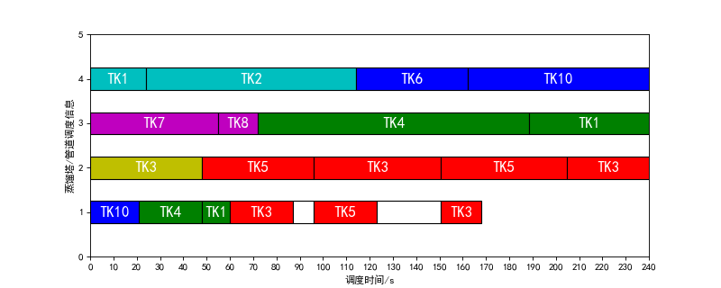
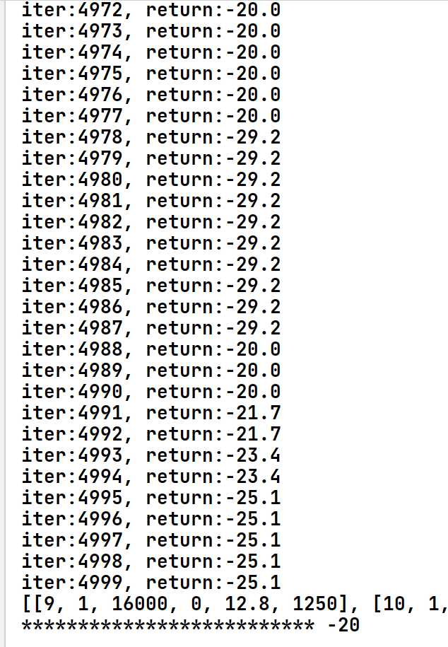

# 优化管道混合成本

### 	结果：



> 

### 参数：


```
actionsList = [111, 112, 122, 132, 212, 222, 232, 142, 242 ]
```

```
num_episodes = 5000  # 总迭代次数
gamma = 0.99 # 折扣因子
actor_lr = 2e-4  # 策略网络的学习率
critic_lr = 2e-4  # 价值网络的学习率
n_hiddens = 16  # 隐含层神经元个数
return_list = []  # 保存每个回合的return
# ----------------------------------------- #
# 环境加载
# ----------------------------------------- #
env = Env()
n_states =6  # 状态数
n_actions =9# 动作数
```

### 算例：

```
self.TK = [
            [1, 5, 16000, 8000],
            [2, 5, 34000, 30000],
            [3, 4, 34000, 30000],
            [4, 0, 34000, 0],
            [5, 3, 34000, 30000],
            [6, 1, 16000, 16000],
            [7, 6, 20000, 16000],
            [8, 6, 16000, 5000],
            [9, 0, 16000, 0],
            [10, 0, 30000, 0]
        ]
        # RT=[编号，炼油类型，炼油量,炼油类型，炼油量]
        self.RT = [
            [1, 5, 38000, 1, 41996],
            [2, 6, 21000, 2, 49000],
            [3, 4, 30000, 3, 120000]
        ]
        # 初始化状态
        #0·1·2：[the completion rate of each refining tower]
        #3：the availability of the supply tank of each refining tower at time t
        #4:current time
        #5: the number of empty tank which never used


        self.INITSTATE =[0,0,0,
                         3,0,3]

        #罐日志，数组下标+1=罐编号，元素为[chargeTIME,refinetime,cot1,cot2]
        self.log_tank = [[0, 0] for _ in range(len(self.TK))]
        #常量
        self.RESIDENCE_TIME = 6
        self.F_SDU = [333.3, 291.7, 625]
        self.Mt = [[0, 11, 12, 13, 10, 15],
              [11, 0, 11, 12, 13, 10],
              [12, 11, 0, 10, 12, 13],
              [13, 12, 10, 0, 11, 12],
              [10, 13, 12, 11, 0, 11],
              [15, 10, 13, 12, 11, 0]]
        self.Mp = [[0, 11, 12, 13, 7, 15],
              [10, 0, 9, 2, 13, 7],
              [13, 8, 0, 7, 2, 13],
              [13, 12, 7, 0, 11, 12],
              [7, 13, 12, 11, 0, 11],
              [15, 7, 13, 12, 11, 0]]
        # 是否为安全状态
        self.SecureState = True
        # 两个计划
        self.schedule_distiller = [[], [], []]  # [TANK,COT,V,START,END]
        self.schedule_pipe = []  # [TANK,COT,V,START,END,(RATE]
        # 辅助
        self.time_ODT = 0
        self.time_ODF = [0, 0, 0]
        self.usedTank=7
        self.preCOT=None


        self.max_steps = 15


        self.refine()  # 预调度
```

