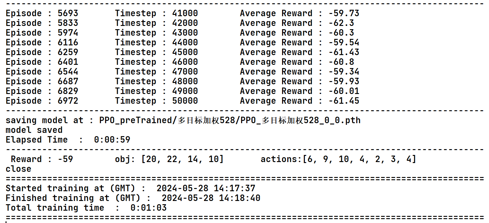

## param

```
 ####### initialize environment hyperparameters ######


    has_continuous_action_space = False  # continuous action space; else discrete

    max_ep_len = 100                  # max timesteps in one episode1000
    max_training_timesteps = int(5e4)   # break training loop if timeteps > max_training_timesteps:3e6

    print_freq = max_ep_len * 10        # print avg reward in the interval (in num timesteps)
    log_freq = max_ep_len * 2           # log avg reward in the interval (in num timesteps)
    save_model_freq = int(1e4)          # save model frequency (in num timesteps)

    action_std = 0.6                    # starting std for action distribution (Multivariate Normal)
    action_std_decay_rate = 0.05        # linearly decay action_std (action_std = action_std - action_std_decay_rate)
    min_action_std = 0.1                # minimum action_std (stop decay after action_std <= min_action_std)
    action_std_decay_freq = int(2.5e5)  # action_std decay frequency (in num timesteps)
    #####################################################

    ## Note : print/log frequencies should be > than max_ep_len

    ################ PPO hyperparameters ################
    update_timestep = max_ep_len * 4      # update policy every n timesteps
    K_epochs = 80               # update policy for K epochs in one PPO update

    eps_clip = 0.2          # clip parameter for PPO
    gamma = 0.99            # discount factor

    lr_actor = 0.0003       # learning rate for actor network
    lr_critic = 0.001       # learning rate for critic network

    random_seed = 0         # set random seed if required (0 = no random seed)
    #####################################################
```

