# 20240605-S22A9-{22,10,13,10}-case1

> CODE [07-PPO-0605-S22A9-22-10-13-10](..\07-PPO-0605-S22A9-22-10-13-10) 
>
> 算例:<u>炼油厂原油处理短期生产计划调度优化_侯艳.</u>  case1


### reward

  [22,10,13,10]-[0,0,0,7]=48,失败=-200

### Action9

实验结果：48==【22，10，13，10】

```py
		#塔：1.最急迫，  2.最不紧迫
        #罐：1.体积最小  2.体积最大  3.体积最接近 4.罐底混合最小
        #泵速 1.nil     2.1250
        #return : state reward done
        #***************************************字典映射***************************************************************
        # 创建动作列表
        actionsList = [111,
                       112, 122, 132, 142,
                       212, 222, 232, 242]
```

### state22

```python
    def updataState(self):
        # 初始化状态22位
        # 0     :  [the completion rate of all refining tower]
        # 1·2 3 :  [the completion rate of each refining tower]
        # 4-13  :  [每个罐的存有情况%]
        # 14    :  [空罐数]
        # 15    :  [未使用过的空罐数]
        # 16    :  [曾使用过的空罐数]
        # 17    :  [所以罐的平均使用次数]
        # 18    :  [管道停运次数]
        # 19    :  [管道转运原油次数]
        # 20    :  [管道平均转运速率/1000]
        # 21    :  [管道混合次数]

        state = [0 for _ in range(22)]

        # 0     :  [the completion rate of all refining tower]
        undistiller_volumn = 0
        for rti in self.RT:
            undistiller_volumn += rti[2] + rti[4]
        state[0] = round(1 - (undistiller_volumn / (sum(self.F_SDU) * 240)), 2)
        # 1·2 3 :  [the completion rate of each refining tower]
        for i in range(3):
            state[i + 1] = round(1 - ((self.RT[i][2] + self.RT[i][4]) / (240 * self.F_SDU[i])), 2)
        # 4-13  :  [每个罐的存有情况%]
        for i in range(len(self.TK)):
            if (self.log_tank[i][1] <= (self.time_ODT) and self.TK[i][3] == 0):
                state[i + 4] = 0
            elif (self.TK[i][3] == 0):

                state[i + 4] = round(self.log_tank[i][-1][1] / self.TK[i][2], 2)
            else:
                state[i + 4] = round(self.TK[i][3] / self.TK[i][2], 2)

        # 14    :  [空罐数]
        # 15    :  [未使用过的空罐数]
        # 16    :  [曾使用过的空罐数]
        # 17    :  [mean所有罐的使用次数]
        for i in range(len(self.TK)):
            if (self.log_tank[i][1] <= (self.time_ODT) and self.TK[i][3] == 0):
                state[14] += 1
                if (len(self.log_tank[i]) == 2):
                    state[15] += 1
                else:
                    state[16] += 1
            state[17] += (len(self.log_tank[i]) - 2)
        state[17] /= len(self.TK)

        # [TANK,COT,V,START,END,(RATE]
        # 18    :  [管道停运次数]
        # 19    :  [管道转运原油次数]
        # 20    :  [管道平均转运速率/1000]
        # 21    :  [管道混合次数]
        if (len(self.schedule_pipe) != 0):
            for schedule in self.schedule_pipe:
                if (schedule[2] == 0):
                    state[18] += 1
                state[19] += 1
                state[20] += schedule[2] / 1000
            state[20] = round(state[20] / self.time_ODT, 2)

            cot_list = []
            for i in range(len(self.schedule_pipe)):
                if (self.schedule_pipe[i][1] != 0):
                    cot_list.append(self.schedule_pipe[i][1])
            for i in range(len(cot_list) - 1):
                if (cot_list[i + 1] != cot_list[i]):
                    state[21] += 1

        return state
```

### param 

 action_std = 0.6  

```py
print("============================================================================================")

    ####### initialize environment hyperparameters ######


    has_continuous_action_space = False  # continuous action space; else discrete

    max_ep_len = 100                  # max timesteps in one episode:1000
    max_training_timesteps = int(1e5)   # break training loop if timeteps > max_training_timesteps:3e6

    print_freq = max_ep_len * 10        # print avg reward in the interval (in num timesteps)
    log_freq = max_ep_len * 2           # log avg reward in the interval (in num timesteps)
    save_model_freq = int(1e4)          # save model frequency (in num timesteps):1e4

    action_std = 0.6                    # starting std for action distribution (Multivariate Normal)
    action_std_decay_rate = 0.05        # linearly decay action_std (action_std = action_std - action_std_decay_rate)
    min_action_std = 0.1                # minimum action_std (stop decay after action_std <= min_action_std)
    action_std_decay_freq = int(2.5e5)  # action_std decay frequency (in num timesteps):2.5e5连续空间
    #####################################################

    ## Note : print/log frequencies should be > than max_ep_len

    ################ PPO hyperparameters ################
    update_timestep = max_ep_len * 4      # update policy every n timesteps
    K_epochs = 80               # update policy for K epochs in one PPO update

    eps_clip = 0.2          # clip parameter for PPO
    gamma = 0.99            # discount factor

    lr_actor = 1e-4      # learning rate for actor network
    lr_critic = 1e-4      # learning rate for critic network

    random_seed = 0         # set random seed if required (0 = no random seed)
```

### result

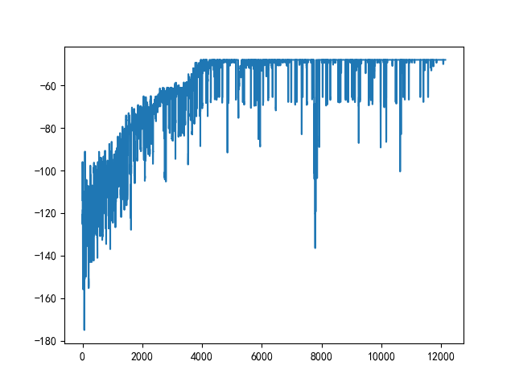

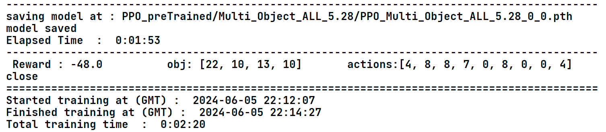

# 20240606-S22A13-{20,10,13,10}-case1

code: [08-PPO-0606-S22A13-20-10-13-10](..\08-PPO-0606-S22A13-20-10-13-10) 

> 加入最大停运次数5 
>
> 动作空间优化
>
> 算例:<u>炼油厂原油处理短期生产计划调度优化_侯艳.</u>  case1

### reward

 [20,10,13,10]-[0,0,0,7]=46,失败=-200


### action13

```python
    def step(self, action,render=False,rendertime=0.3):
        #塔：1.最急迫，  2.最不紧迫  3.管道混合成本最小
        #罐：1.体积最小  2.体积最大  3.体积最接近 4.罐底混合最小
        #泵速 1.nil     2.1250
        #return : state reward done
        #***************************************字典映射***************************************************************
        # 创建动作列表
        actionsList = [111,
                       112, 122, 132, 142,
                       212, 222, 232, 242,
                       312, 322, 332, 342]
```

### state22

```python
    def updataState(self):
        # 初始化状态22位
        # 0     :  [the completion rate of all refining tower]
        # 1·2 3 :  [the completion rate of each refining tower]
        # 4-13  :  [每个罐的存有情况%]
        # 14    :  [空罐数]
        # 15    :  [未使用过的空罐数]
        # 16    :  [曾使用过的空罐数]
        # 17    :  [所以罐的平均使用次数]
        # 18    :  [管道停运次数]
        # 19    :  [管道转运原油次数]
        # 20    :  [管道平均转运速率/1000]
        # 21    :  [管道混合次数]

        state = [0 for _ in range(22)]

        # 0     :  [the completion rate of all refining tower]
        undistiller_volumn = 0
        for rti in self.RT:
            undistiller_volumn += rti[2] + rti[4]
        state[0] = round(1 - (undistiller_volumn / (sum(self.F_SDU) * 240)), 2)
        # 1·2 3 :  [the completion rate of each refining tower]
        for i in range(3):
            state[i + 1] = round(1 - ((self.RT[i][2] + self.RT[i][4]) / (240 * self.F_SDU[i])), 2)
        # 4-13  :  [每个罐的存有情况%]
        for i in range(len(self.TK)):
            if (self.log_tank[i][1] <= (self.time_ODT) and self.TK[i][3] == 0):
                state[i + 4] = 0
            elif (self.TK[i][3] == 0):

                state[i + 4] = round(self.log_tank[i][-1][1] / self.TK[i][2], 2)
            else:
                state[i + 4] = round(self.TK[i][3] / self.TK[i][2], 2)

        # 14    :  [空罐数]
        # 15    :  [未使用过的空罐数]
        # 16    :  [曾使用过的空罐数]
        # 17    :  [mean所有罐的使用次数]
        for i in range(len(self.TK)):
            if (self.log_tank[i][1] <= (self.time_ODT) and self.TK[i][3] == 0):
                state[14] += 1
                if (len(self.log_tank[i]) == 2):
                    state[15] += 1
                else:
                    state[16] += 1
            state[17] += (len(self.log_tank[i]) - 2)
        state[17] /= len(self.TK)

        # [TANK,COT,V,START,END,(RATE]
        # 18    :  [管道停运次数]
        # 19    :  [管道转运原油次数]
        # 20    :  [管道平均转运速率/1000]
        # 21    :  [管道混合次数]
        if (len(self.schedule_pipe) != 0):
            for schedule in self.schedule_pipe:
                if (schedule[2] == 0):
                    state[18] += 1
                state[19] += 1
                state[20] += schedule[2] / 1000
            state[20] = round(state[20] / self.time_ODT, 2)

            cot_list = []
            for i in range(len(self.schedule_pipe)):
                if (self.schedule_pipe[i][1] != 0):
                    cot_list.append(self.schedule_pipe[i][1])
            for i in range(len(cot_list) - 1):
                if (cot_list[i + 1] != cot_list[i]):
                    state[21] += 1

        return state
```


### param

lr_actor = 3e-4

```py
has_continuous_action_space = False  # continuous action space; else discrete

    max_ep_len = 100                  # max timesteps in one episode:1000
    max_training_timesteps = int(1e5)   # break training loop if timeteps > max_training_timesteps:3e6

    print_freq = max_ep_len * 10        # print avg reward in the interval (in num timesteps)
    log_freq = max_ep_len * 2           # log avg reward in the interval (in num timesteps)
    save_model_freq = int(1e4)          # save model frequency (in num timesteps):1e4

    action_std = 0.6                    # starting std for action distribution (Multivariate Normal)
    action_std_decay_rate = 0.05        # linearly decay action_std (action_std = action_std - action_std_decay_rate)
    min_action_std = 0.1                # minimum action_std (stop decay after action_std <= min_action_std)
    action_std_decay_freq = int(2.5e5)  # action_std decay frequency (in num timesteps):2.5e5连续空间
    #####################################################

    ## Note : print/log frequencies should be > than max_ep_len

    ################ PPO hyperparameters ################
    update_timestep = max_ep_len * 2      # update policy every n timesteps
    K_epochs = 80               # update policy for K epochs in one PPO update

    eps_clip = 0.2          # clip parameter for PPO
    gamma = 0.99            # discount factor

    lr_actor = 3e-4    # learning rate for actor network
    lr_critic = 3e-4      # learning rate for critic network

    random_seed = 0         # set random seed if required (0 = no random seed)
    #####################################################
    env_name = "Multi_Object_ALL_5.28"
    print("training environment name : " + env_name)

    env = Env()
```

### result

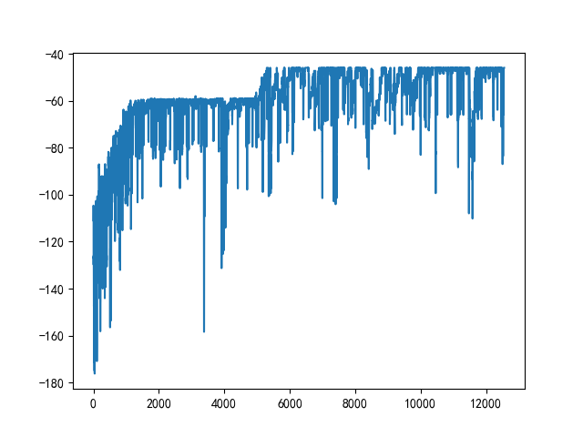

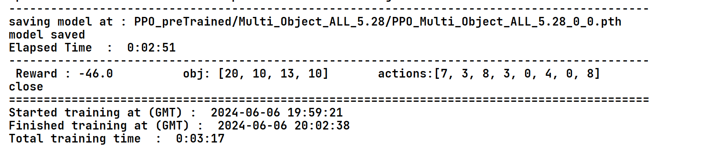

### test

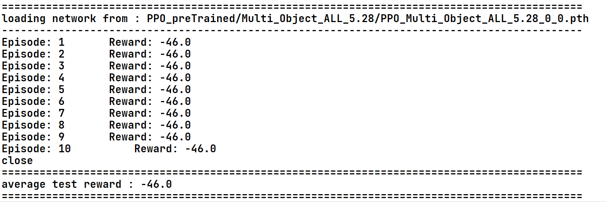

# 20240611-S22A37-energy-case2

> 新加优化目标“能耗”
>
> 采用新的算例“<u>考虑能耗优化的多目标原油短期调度问题研究_侯艳</u>”
>
> 
>
> 

code: [09-PPO-0611-S22A37-[18, 23, 11, 9, 152]](..\09-PPO-0611-S22A37-[18, 23, 11, 9, 152]) 

优化refine，charge ,selectDistiller函数(type==3存在bug)

优化self_init 的action,state和target
优化self.pipe_velocity，self.residual_crude_oil_type_pipe=0，self.schedule_pipe

优化done的判断

优化Gantt图的显示效果

新增self.reward_weight=[1,1,1,1,0.2]

新增（外部函数）泵速组合转换器pump_speed_combination_generator:将泵速转为列表，1300=【0，0，0.6,0.4】

### exam&action37

```python
    def __init__(self):

        # TKi=[编号，类型，容量，存量]
        self.TK = [
            [1, 3, 34000, 27000],
            [2, 2, 34000, 30000],
            [3, 4, 34000, 27000],
            [4, 5, 34000, 30000],
            [5, 5, 34000, 25000],
            [6, 0, 34000, 0],
            [7, 0, 20000, 0],
            [8, 0, 20000, 0],
            [9, 0, 20000, 0]
        ]
        # RT=[编号，炼油类型，炼油量,炼油类型，炼油量]
        #蒸馏塔3的子任务为三个，refine and charge函数需要改变
        self.RT = [
            [1, 3, 27000, 1, 63000],
            [2, 2, 55200, 0, 0],
            [3, 4, 27000, 5, 55000, 6, 38000]
        ]
        #罐日志，数组下标+1=罐编号，元素为[chargeTIME,refinetime,[oilType,refineVolume]]
        self.log_tank = [[0, 0] for _ in range(len(self.TK))]
        #常量
        self.RESIDENCE_TIME = 6
        self.F_SDU = [375, 230, 500]
        self.pipe_velocity=[0,833.3,1250,1375]
        #Mt and Mp 与上一算例一致
        self.Mt = [
              [0, 11, 12, 13, 10, 15],
              [11, 0, 11, 12, 13, 10],
              [12, 11, 0, 10, 12, 13],
              [13, 12, 10, 0, 11, 12],
              [10, 13, 12, 11, 0, 11],
              [15, 10, 13, 12, 11, 0]]
        self.Mp = [
              [0, 11, 12, 13, 7, 15],
              [10, 0, 9, 12, 13, 7],
              [13, 8, 0, 7, 12, 13],
              [13, 12, 7, 0, 11, 12],
              [7, 13, 12, 11, 0, 11],
              [15, 7, 13, 12, 11, 0]]
        # 是否为安全状态
        self.SecureState = True
        # 两个计划
        self.schedule_distiller = [[], [], []]  # [TANK,COT,V,START,END]
        self.schedule_pipe = []  # [TANK,COT,V,START,END,RATE]
        # 辅助time
        self.time_ODT = 0
        self.time_ODF = [0, 0, 0]
        #优化目标
        self.target=[0,0,0,0,0]
        self.preTarget=[0,0,0,5,0]#-----------------随算例改变而改变------------------------

        self.refine()  # 预调度
        #管道残留原油类型(charge时需要同步修改，处默认情况下为0外，其他情况不允许为0
        self.residual_crude_oil_type_pipe=0
        #state
        self.INITSTATE = self.updataState()#INITSTATE需要在预调度之后
        self.n_states = len(self.INITSTATE)

        #action
        # action:(3*4*3)+1=36+1
        # 塔：1.最急迫，  2.最不紧迫  3.选择同上一操作相同的蒸馏塔
        # 罐：1.体积最小  2.体积最大  3.体积最接近 4.罐底混合最小
        # 泵速 1.nil     2.833.3   3.1250     4.1375
        self.actionsList = [111,

                           112, 122, 132, 142,
                           212, 222, 232, 242,
                           312, 322, 332, 342,

                           113, 123, 133, 143,
                           213, 223, 233, 243,
                           313, 323, 333, 343,

                           114, 124, 134, 144,
                           214, 224, 234, 244,
                           314, 324, 334, 344,
                           ]
        self.n_actions = len(self.actionsList)
```

### state22&param

与20240606-S22A13-{20,10,13,10}不变

### reward

```python
reward=0
 for i in range(len(self.reward_weight)):
     reward += self.reward_weight[i]*(self.preTarget[i] - self.target[i])

```

失败-400

### result

在self.reward_weight=[1,1,1,1,0.2]下进行实验

```
Reward : -86.4        obj=[18, 23, 11, 9, 152]            action= [10, 11, 11, 2, 3, 3]    
Reward : -85.4 		 obj: [18, 22, 11, 9, 152.0]		 actions:[3, 10, 12, 2, 5, 12]
```


在self.reward_weight=[0，0，0，1，0]下 进行实验，轻易寻得最小用罐1

```
Reward : -1.0 		 obj: [36, 45, 10, 6, 222.0]		 actions:[34, 0, 14, 14, 0, 14, 18]
```

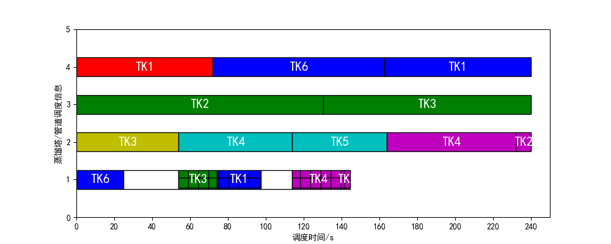

# 20240612-S22A47-overlapTime-case2

> 算例“<u>考虑能耗优化的多目标原油短期调度问题研究_侯艳</u>”
>
> 新加约束“<u>带罐约束</u>”      *带罐时间比1：1*

 [10-PPO-0613-S22A37-overlapTime](..\10-PPO-0613-S22A37-overlapTime) 

```python
#带罐约束的引入：根据引理>>>>RT+(r1/r1+r2)Time_overlap
#                       (r2/r1+r2)Time_overlap

#在r1:r2=1:1时：
#   在不考虑带罐约束的模型下：
#       接收完原油的供油罐需要在RT+2才可以被蒸馏塔调用
#       蒸馏完的空罐需要在2小时后才可被重新充油
#   即：tank2实际的ODF开始时间要比原先的时间提前2小时
#      tank1实际的ODF结束时间要比原先的时间推出2小时

#更改refine函数中炼油完毕对log_tank的操作，refineTIME在原先的基础上+(r2/r1+r2)Time_overlap，即蒸馏完的空罐需要在2小时后才可被重新充油
self.log_tank[tank[0] - 1][1] = endTime+(0.5*self.Charging_Tank_Switch_Overlap_Time)

#更改charge函数中充油完毕对log_tank的操作，chargeTIME在原先的基础上+(r1/r1+r2)Time_overlap，即接收完原油的供油罐需要在RT+2才可以被蒸馏塔调用
self.log_tank[tank - 1][0] = round(startTime + volume / rate + self.RESIDENCE_TIME,1)+(0.5*self.Charging_Tank_Switch_Overlap_Time)


#------------对Gantt的渲染进行改进
```

### action&state&reward

与上述一致

### result

在self.reward_weight=[1,1,1,1,0.2]下进行实验（最优

```
Reward : -85.4 		 obj: [18, 22, 11, 9, 152.0]		 actions:[3, 10, 12, 2, 5, 12]
```

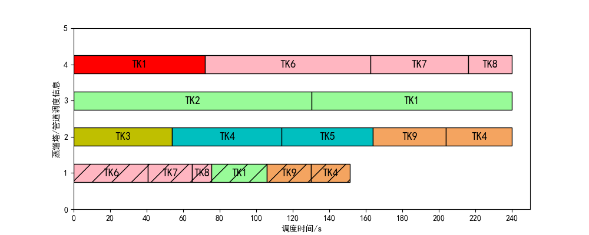

# 20240614-S22A157-pumpSpeed-case2

 [11-PPO-0614-S22A157-pumpSpeed](..\11-PPO-0614-S22A157-pumpSpeed) 

> 在带罐约束的条件下，action由37>>>157
>
> 算例“<u>考虑能耗优化的多目标原油短期调度问题研究_侯艳</u>”
>
> PPO卷积核由64>>128

### action

```python
#action
        # action:(3*4*13)+1=156+1
        # 塔： 1.最急迫，  2.最不紧迫  3.选择同上一操作相同的蒸馏塔
        # 罐： 1.体积最小  2.体积最大  3.体积最接近 4.罐底混合最小
        # 泵速: 0 835（833）,880,925,970,1015,1060,1105,1150,1195,1240,1285,1330,1375=1+13

        #action的扩张，step函数不再以字典的方式读取：
            # # 创建字典
            # action_dict = {i: action for i, action in enumerate(self.actionsList)}
            # action = action_dict[action]
            #
            # # 操作定义
            # rate = self.pipe_velocity[(action % 10) - 1]
            # disitller = self.selectDistiller(action // 100) if rate != 0 else None
            # tank = self.selectTank((action % 100) // 10, disitller) if rate != 0 else None

        #新的动作解码方式:↓ ↓ ↓ ↓ ↓ ↓ ↓ ↓ ↓ ↓ ↓ ↓ ↓ ↓ ↓ ↓ ↓ ↓ ↓ ↓ ↓ ↓ ↓ ↓ ↓ ↓ ↓ ↓ ↓ ↓ ↓ ↓ ↓ ↓ ↓ ↓
        #

        # 传入action（0——144）：0=停运
        #                     1——144： 1-12=泵速833
        #                           : 13- 24=泵速880
        #                           : 25- 36=泵速925
        #                           :133-144=泵速1330
        #                           :145-156=泵速1375


        #泵速：[0 835（833）,880,925,970,1015,1060,1105,1150,1195,1240,1285,1330,1375]
        #rateListIndex=math.ceil(action/12)
        #   rateListIndex=0:0
        #   rateListIndex=1:833
        #   rateListIndex=2:880
        #   rateListIndex=13:1375


        #罐塔组合：[11,12,13,14,  21,22,23,24,  31,32,33,34]
        #TDListIndex=action%12>>TankAndDistiller
        #   TDListIndex=0:11
        #   TDListIndex=1:12
        #   TDListIndex=11:34


        #rate=self.rateList[rateListIndex]
        #disitller=TankAndDistiller//10
        #tank=TankAndDistiller%10

        self.rateList=[0,833,880,925,970,1015,1060,1105,1150,1195,1240,1285,1330,1375]#1+13
        self.TDList=[11,12,13,14,  21,22,23,24,  31,32,33,34]#12


        self.n_actions = (len(self.rateList)-1)*len(self.TDList)+1
```

```python
#新的动作解码方式:↓ ↓ ↓ ↓ ↓ ↓ ↓ ↓ ↓ ↓ ↓ ↓ ↓ ↓ ↓ ↓ ↓ ↓ ↓ ↓ ↓ ↓ ↓ ↓ ↓ ↓ ↓ ↓ ↓ ↓ ↓ ↓ ↓ ↓ ↓ ↓
        rateListIndex=math.ceil(action/12)
        TDListIndex = action % 12
        TankAndDistiller=self.TDList[TDListIndex]

        rate=self.rateList[rateListIndex]

        disitller =self.selectDistiller( TankAndDistiller // 10) if rate != 0 else None

        tank=self.selectTank(TankAndDistiller%10,disitller) if rate != 0 else None
```


### state&reward

不变

### result

```
--------------------------------------------------------------------------------------------
Episode : 78809 		 Timestep : 481000 		 Average Reward : -90.36
Episode : 78975 		 Timestep : 482000 		 Average Reward : -89.31
Episode : 79141 		 Timestep : 483000 		 Average Reward : -91.99
Episode : 79306 		 Timestep : 484000 		 Average Reward : -102.16
Episode : 79472 		 Timestep : 485000 		 Average Reward : -95.0
Episode : 79638 		 Timestep : 486000 		 Average Reward : -93.42
Episode : 79804 		 Timestep : 487000 		 Average Reward : -91.9
Episode : 79970 		 Timestep : 488000 		 Average Reward : -89.85
Episode : 80136 		 Timestep : 489000 		 Average Reward : -93.8
Episode : 80301 		 Timestep : 490000 		 Average Reward : -99.34
--------------------------------------------------------------------------------------------
saving model at : PPO_preTrained/Multi_Object_ALL_5.28/PPO_Multi_Object_ALL_5.28_0_0.pth
model saved
Elapsed Time  :  0:19:29
--------------------------------------------------------------------------------------------
Episode : 80466 		 Timestep : 491000 		 Average Reward : -100.53
Episode : 80631 		 Timestep : 492000 		 Average Reward : -97.44
Episode : 80797 		 Timestep : 493000 		 Average Reward : -90.75
Episode : 80962 		 Timestep : 494000 		 Average Reward : -94.35
Episode : 81127 		 Timestep : 495000 		 Average Reward : -97.55
Episode : 81293 		 Timestep : 496000 		 Average Reward : -91.53
Episode : 81459 		 Timestep : 497000 		 Average Reward : -90.72
Episode : 81625 		 Timestep : 498000 		 Average Reward : -90.1
Episode : 81791 		 Timestep : 499000 		 Average Reward : -90.53
Episode : 81957 		 Timestep : 500000 		 Average Reward : -94.05
--------------------------------------------------------------------------------------------
saving model at : PPO_preTrained/Multi_Object_ALL_5.28/PPO_Multi_Object_ALL_5.28_0_0.pth
model saved
Elapsed Time  :  0:19:53
--------------------------------------------------------------------------------------------
 Reward : -89.80000000000001 	 obj: [18, 25, 11, 9, 159.0]		 actions:[11, 46, 10, 13, 30, 6]
close
============================================================================================
Started training at (GMT) :  2024-06-14 16:10:35
Finished training at (GMT) :  2024-06-14 16:30:48
Total training time  :  0:20:13
============================================================================================
```

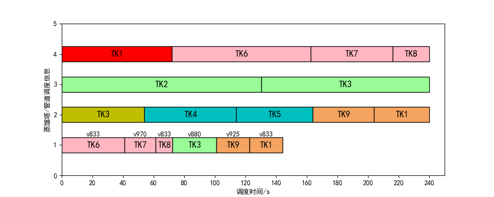

# 20240614-S22A85-pumpSpeed-case2

 [12-PPO-0615-S22A85-pumpSpeed](..\12-PPO-0615-S22A85-pumpSpeed) 

> 在带罐约束的条件下，action由37>>>85
>
> 算例“<u>考虑能耗优化的多目标原油短期调度问题研究_侯艳</u>”case2
>
> PPO卷积核由64>>128
>
> **表现优于A157**


```python
#action
        # action:(3*4*7)+1=84+1
        # 塔： 1.最急迫，  2.最不紧迫  3.选择同上一操作相同的蒸馏塔
        # 罐： 1.体积最小  2.体积最大  3.体积最接近 4.罐底混合最小
        # 泵速: 0 +835（833）,925,1015,1105,1195,1285,1375=1+7

        #action的扩张，step函数不再以字典的方式读取：
            # # 创建字典
            # action_dict = {i: action for i, action in enumerate(self.actionsList)}
            # action = action_dict[action]
            #
            # # 操作定义
            # rate = self.pipe_velocity[(action % 10) - 1]
            # disitller = self.selectDistiller(action // 100) if rate != 0 else None
            # tank = self.selectTank((action % 100) // 10, disitller) if rate != 0 else None

        #新的动作解码方式:↓ ↓ ↓ ↓ ↓ ↓ ↓ ↓ ↓ ↓ ↓ ↓ ↓ ↓ ↓ ↓ ↓ ↓ ↓ ↓ ↓ ↓ ↓ ↓ ↓ ↓ ↓ ↓ ↓ ↓ ↓ ↓ ↓ ↓ ↓ ↓
        #

        # 传入action（0——144）：0=停运
        #                     1——144： 1-12=泵速833
        #                           : 13- 24=泵速880
        #                           : 25- 36=泵速925
        #                           :133-144=泵速1330
        #                           :145-156=泵速1375


        #泵速：[0 835（833）,880,925,970,1015,1060,1105,1150,1195,1240,1285,1330,1375]
        #rateListIndex=math.ceil(action/12)
        #   rateListIndex=0:0
        #   rateListIndex=1:833
        #   rateListIndex=2:880
        #   rateListIndex=13:1375


        #罐塔组合：[11,12,13,14,  21,22,23,24,  31,32,33,34]
        #TDListIndex=action%12>>TankAndDistiller
        #   TDListIndex=0:11
        #   TDListIndex=1:12
        #   TDListIndex=11:34


        #rate=self.rateList[rateListIndex]
        #disitller=TankAndDistiller//10
        #tank=TankAndDistiller%10

        self.rateList=[0,833,925,1015,1105,1195,1285,1375]#1+7
        self.TDList=[11,12,13,14,  21,22,23,24,  31,32,33,34]#12


        self.n_actions = (len(self.rateList)-1)*len(self.TDList)+1
```

### result

```
--------------------------------------------------------------------------------------------
saving model at : PPO_preTrained/Multi_Object_ALL_5.28/PPO_Multi_Object_ALL_5.28_0_0.pth
model saved
Elapsed Time  :  0:08:40
--------------------------------------------------------------------------------------------
Episode : 47526 		 Timestep : 291000 		 Average Reward : -91.39
Episode : 47687 		 Timestep : 292000 		 Average Reward : -90.86
Episode : 47851 		 Timestep : 293000 		 Average Reward : -90.44
Episode : 48015 		 Timestep : 294000 		 Average Reward : -90.22
Episode : 48177 		 Timestep : 295000 		 Average Reward : -87.03
Episode : 48342 		 Timestep : 296000 		 Average Reward : -89.85
Episode : 48507 		 Timestep : 297000 		 Average Reward : -86.9
Episode : 48672 		 Timestep : 298000 		 Average Reward : -90.05
Episode : 48835 		 Timestep : 299000 		 Average Reward : -87.87
Episode : 48998 		 Timestep : 300000 		 Average Reward : -89.92
--------------------------------------------------------------------------------------------
saving model at : PPO_preTrained/Multi_Object_ALL_5.28/PPO_Multi_Object_ALL_5.28_0_0.pth
model saved
Elapsed Time  :  0:08:59
--------------------------------------------------------------------------------------------
 Reward : -85.8 		 obj: [18, 22, 11, 9, 154.0]		 actions:[11, 8, 11, 1, 10, 19]
close
============================================================================================
Started training at (GMT) :  2024-06-20 13:46:18
Finished training at (GMT) :  2024-06-20 13:55:39
Total training time  :  0:09:21
============================================================================================
```

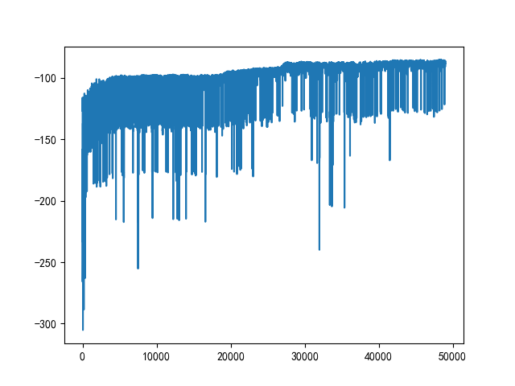


​                                                                                         


# 20240620-S22A49-dynaSpeed-case2

 [13-PPO-0620-S22A49-dynaSpeed](..\13-PPO-0620-S22A49-dynaSpeed) 

> 算例“<u>考虑能耗优化的多目标原油短期调度问题研究_侯艳</u>”case2
>
> PPO卷积核由128>>64
>
> 动态转运速度的引入

```python
#param:
#       type=[0,833,1250,1375,"dynamic"]
#       volume=int
#       distiller=蒸馏塔的实际编号
#       startTime=本次调度的开始时间
#return:rate int

#动态选择管道转运速率：
#   1.管道最小速率为833.3。
#	即管道转运速率的范围为（833.3~1375）case2，低与833.3的速率划分为两个ODT（833.3*k1+0*k2）的形式
#   2.动态速率的选择考量：
#
#       计算前应得到本次ODT需要转运的体积，体积确定由distiller和tank求得
#           ——应当改变rate,distiller tank的获取顺序
#           ——转运体积的计算在原先charge函数内求得
#               ——selectRate函数的调用由charge函数执行
#
#       当前状态下本次ODT所对应蒸馏塔中最晚的补给时间：latest_feed_time（大于当前时刻 同时要求满足带罐约束）
#       当前状态下各个供油罐中最早的释放时间:earliest_release_time（大于当前时刻 同时要求满足带罐约束）
#
#
#       通过确定本次ODT的结束时间来得出本次ODT采用的速率。
#       ODT的结束时间：
#           ①latest_feed_time-self.RESIDENCE_TIME-self.Charging_Tank_Switch_Overlap_Time：
#               在本次ODT完成后该供油罐经过滞留时间后供给给对应的distiller
#               令endTime=latest_feed_time-self.RESIDENCE_TIME-self.Charging_Tank_Switch_Overlap_Time
#               应保证volume/(endTime-startTime)>=833.3,否则rate=833.3
#               此外:
#                   如果volume/(endTime-startTime)>=1375，则系统已经处在不安全状态，调度失败
#
#           ② earliest_release_time：nextState有更多的空罐可供选择
#               如果由①的出rate==833.3：
#               并且volume/(earliest_release_time-startTime)>=833.3，<=1375:
#                   rate=volume/(earliest_release_time-startTime)
#
#               若(earliest_release_time-startTime)/volume>=1375:
#                   则舍弃当前的earliest_release_time，顺位取下一个
#               上述条件无法满足的情况下默认为833.3
```

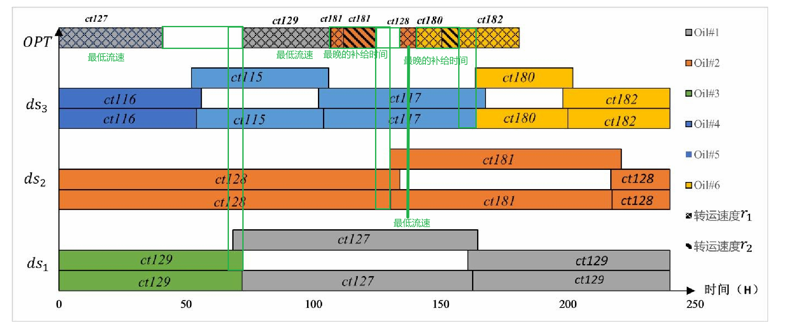

### action

```py
   		# action:(3*4*4)+1=48+1
        # 塔： 1.最急迫，  2.最不紧迫  3.选择同上一操作相同的蒸馏塔
        # 罐： 1.体积最小  2.体积最大  3.体积最接近 4.罐底混合最小
        # 泵速: 0 833,1250,1375，dynamic=1+4
```

### state&reward

保持不变

### result

```
Episode : 15697 		 Timestep : 96000 		 Average Reward : -85.23
Episode : 15862 		 Timestep : 97000 		 Average Reward : -88.41
Episode : 16029 		 Timestep : 98000 		 Average Reward : -88.74
Episode : 16195 		 Timestep : 99000 		 Average Reward : -91.43
Episode : 16361 		 Timestep : 100000 		 Average Reward : -89.13
--------------------------------------------------------------------------------------------
saving model at : PPO_preTrained/Multi_Object_ALL_5.28/PPO_Multi_Object_ALL_5.28_0_0.pth
model saved
Elapsed Time  :  0:04:51
--------------------------------------------------------------------------------------------
 Reward : -85.4 		 obj: [18, 22, 11, 9, 152.0]		 actions:[2, 11, 11, 37, 12, 43]
close
============================================================================================
Started training at (GMT) :  2024-06-20 21:53:19
Finished training at (GMT) :  2024-06-20 21:58:50
Total training time  :  0:05:31
============================================================================================
```

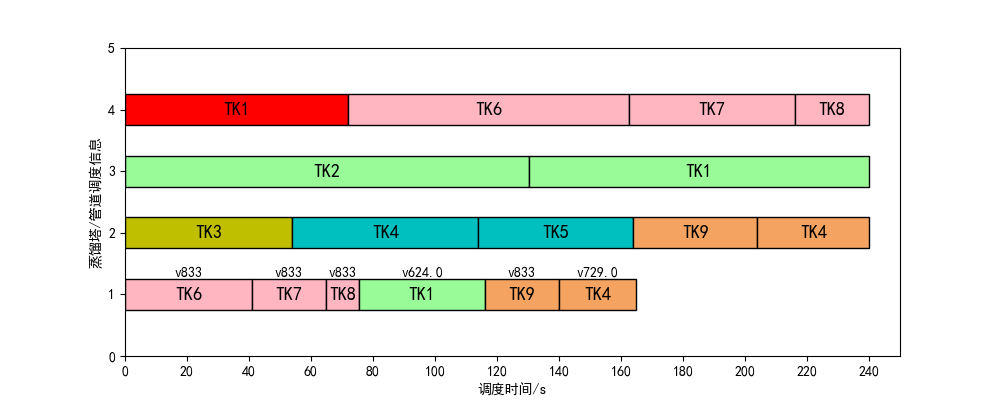

```python
action=[38, 0, 0, 45, 39, 0,  47,  38 , 38]  #[18, 12, 11, 9, 160.0]最优
```

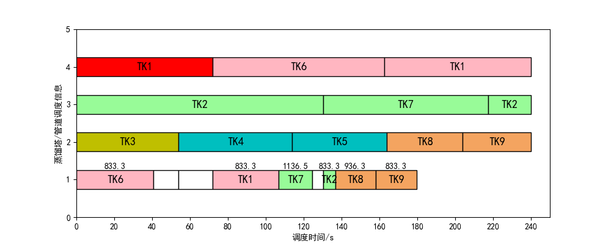

# 20240621-S22A5-dynaSpeed-case2

> 算例“<u>考虑能耗优化的多目标原油短期调度问题研究_侯艳</u>”case2
>
> PPO卷积核由128>>64
>
> 对action进行剪枝actions由原来的49个动作减少至5个(基于调度规则）：
>
> - 转运速率除了停运操作外，统一动态处理。在非停运操作时，只需指定派遣的油罐和蒸馏塔即可。
> - 蒸馏塔的选择：
>   - 最紧迫优先原则：
>     - 若存在多个相同紧迫的蒸馏塔，则优先选择能够使管道混合成本最小的蒸馏塔
>   - 管道混合成本优先原则：
>     - 选择能够使管道混合成本最小的蒸馏塔，若存在多个蒸馏塔转运原油造成的管道混合成本相同时，则优先选择最紧迫的蒸馏塔
>
> - 充油罐的选择：
>
>   - 体积最接近
>
>     - ```python
>       #①：优先选择充油罐容积能够满足蒸馏塔需要的炼油量的充油罐
>       #②：在充油罐容积满足蒸馏塔需求的前提下，有多个充油罐的容积与蒸馏塔需求的原油量最接近时，选择罐底混	   合成本最小的油罐
>       #③：罐底混合成本相同情况下，优先使用旧罐 （新油罐的罐底混合成本设置为0.01）
>       ```
>
>   - 罐底混合成本最小化
>
>     - ```python
>       #①: 新油罐的罐底混合成本为0.01，其目的便是：在罐底混合成本都为0时，优先使用旧的油罐
>       #②：罐底混合成本相同，则选择充油罐容积能够满足蒸馏塔需要的炼油量的充油罐
>       #③：在罐底混合成本相同的条件下，存在多个充油罐容积满足蒸馏塔需求时，选择充油罐容积与蒸馏塔需要的炼油量最接近的充油罐
>       ```


### action

```python
#action
# action:(4)+1=5
# 塔：  1.优先选择最急迫的蒸馏塔     2.选择能够使管道混合成本最小的蒸馏塔
# 罐：  1.优先选择体积最接近原则     2.优先选择罐底混合成本最小的充油罐
# 泵速: 1.停运                     2.不停运dyna
self.actionsList=[0,11,12, 21,22]
self.n_actions = len(self.actionsList)
```

### state&reward

保持不变

### result


```python
最优解
action=[1,0,0,3,2,0,4,2,2]
#[18, 12, 11, 9, 160.0] 
dynamic 11   
0 
0 
dynamic 21
dynamic 12
0 
dynamic 22
dynamic 12
dynamic 12

```


# 20240624-S12A5-dynaSpeed-case2

> 算例case2
>
> 重新定义state
>
> 重新定义action
>
> code: [14-PPO-0624-S12A5-dynaSpeed](..\14-PPO-0624-S12A5-dynaSpeed) 

### state

```python
# 初始化状态12位
# 0     :  [the completion rate of all refining tower]
# 1·2 3 :  [the completion rate of each refining tower]
# 4 5 6 ： [罐底剩余与炼油厂所需类型原油相同类型原油的供油罐数量与总供油罐数量的比值]
# 7 8 9 ： [每个蒸馏塔的最晚派遣供油罐时间-当前时间]/240
# 10    :  [空油罐的数量/总的油罐数量]
# 11    :  [未曾使用的油罐数量/总的油罐数量]
```

action

```python
#action
# action:(4)+1=5
# 塔： 1.最急迫，    2.选择同上一操作相同的蒸馏塔
# 罐： 1.优先体积最接近原则  2.优先罐底混合成本最小原则
# 泵速: 1.停运       2不停运dynamic
```

result

```txt
Episode : 4391 		 Timestep : 28000 		 Average Reward : -69.67
Episode : 4544 		 Timestep : 29000 		 Average Reward : -71.03
Episode : 4694 		 Timestep : 30000 		 Average Reward : -70.11
--------------------------------------------------------------------------------------------
saving model at : PPO_preTrained/Multi_Object_ALL_5.28/PPO_Multi_Object_ALL_5.28_0_0.pth
model saved
Elapsed Time  :  0:00:40
--------------------------------------------------------------------------------------------
 Reward : -69.1 		 obj: [18, 21, 11, 9, 151.0]		 actions:[3, 3, 3, 1, 4, 0, 1]
close
```

# 21-SAC-0703-S12A5-case2

> code: [21-SAC-0703-S12A5-case2](..\21-SAC-0703-S12A5-case2) 

param：

```python
#测试
parser.add_argument('--render', type=str2bool, default=True, help='Render or Not')
parser.add_argument('--Loadmodel', type=str2bool, default=True, help='Load pretrained model or Not')
parser.add_argument('--ModelIdex', type=int, default=400, help='which model to load')

#训练
parser.add_argument('--render', type=str2bool, default=False, help='Render or Not')
parser.add_argument('--Loadmodel', type=str2bool, default=False, help='Load pretrained model or Not')
parser.add_argument('--ModelIdex', type=int, default=400, help='which model to load')
```

state,action

```python
# 塔： 1.最急迫，    2.选择同上一操作相同的蒸馏塔
# 罐： 1.优先体积最接近原则  2.优先罐底混合成本最小原则
# 泵速: 1.停运       2不停运dynamic
self.action_space=[0, 11, 12, 21, 22]
```

```python
# 初始化状态12位
# 0     :  [the completion rate of all refining tower]
# 1·2 3 :  [the completion rate of each refining tower]
# 4 5 6 ： [罐底剩余与炼油厂所需类型原油相同类型原油的供油罐数量与总供油罐数量的比值]
# 7 8 9 ： [每个蒸馏塔的最晚派遣供油罐时间-当前时间]/240
# 10    :  [空油罐的数量/总的油罐数量]
# 11    :  [未曾使用的油罐数量/总的油罐数量]
```

result：

| 来源     | 列2  | 列3  | 列4  | 列5  | 列6  | 列7                         | 列8                |
| -------- | ---- | ---- | ---- | ---- | ---- | --------------------------- | ------------------ |
| SAC-400  | 18   | 21   | 11   | 9    | 151  | [1, 3, 0, 4, 1, 0, 4, 0, 3] | [1,1,1,1,0.1]      |
| SAC-200  | 25   | 13   | 11   | 9    | 151  | [4, 0, 3, 2, 2, 2, 0, 0, 4] | [0.4,1.2,1,1,0.07] |
| SAC(100) | 18   | 45   | 10   | 6    | 153  | [1, 1, 4, 2, 4, 0, 2]       | [1,1,1,5,0.02]     |

