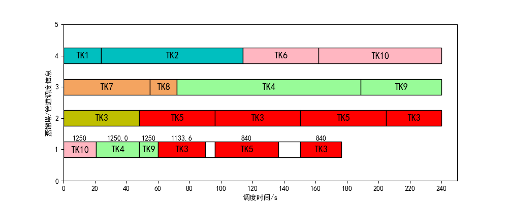

# case3(2017 wsj)

```python
self.TK = [
    [1, 5, 16000, 8000],
    [2, 5, 34000, 30000],
    [3, 4, 34000, 30000],
    [4, 0, 34000, 0],
    [5, 3, 34000, 30000],
    [6, 1, 16000, 16000],
    [7, 6, 20000, 16000],
    [8, 6, 16000, 5000],
    [9, 0, 16000, 0],
    [10, 0, 30000, 0]
]
# RT=[编号，炼油类型，炼油量,炼油类型，炼油量]
self.RT = [
    [1, 5, 38000, 1, 42000],
    [2, 6, 21000, 2, 49008],
    [3, 4, 30000, 3, 120000]
]
self.RESIDENCE_TIME = 6
self.Charging_Tank_Switch_Overlap_Time=0
self.F_SDU = [333.3, 291.7, 625]
self.pipe_velocity_list=[840,1250,1370]
#Mt and Mp 与上一算例一致
self.Mt = [
      [0, 11, 12, 13, 10, 15],
      [11, 0, 11, 12, 13, 10],
      [12, 11, 0, 10, 12, 13],
      [13, 12, 10, 0, 11, 12],
      [10, 13, 12, 11, 0, 11],
      [15, 10, 13, 12, 11, 0]]
self.Mp = [
      [0, 11, 12, 13, 7, 15],
      [10, 0, 9, 12, 13, 7],
      [13, 8, 0, 7, 12, 13],
      [13, 12, 7, 0, 11, 12],
      [7, 13, 12, 11, 0, 11],
      [15, 7, 13, 12, 11, 0]]
```

# SACD with s9a31 

code: [22-SAC-0715-S9A31-CASE3](..\22-SAC-0715-S9A31-CASE3) 

- 修改state中蒸馏塔完成率存在bug
- 加入最大停运次数Max_shutdown_count=3
- 加入动作有效性判断（HS and shutdown)

code:  [23-SAC-0719-S9A31-CASE3](..\23-SAC-0719-S9A31-CASE3) 

- 修改ODT中对转运体积的计算
- 修复charge_low_fusion_oil函数的停运操作存在的bug
- 规范化代码

## s11a31

```python
# 初始化状态11位
# 0 1 2 :  [the completion rate of each refining tower]
# 3 4 5 ： [是否存在罐底残留原油的类型与炼油厂所需类型原油相同类型原油的供油罐 0 or 1]
# 6 7 8 ： [每个蒸馏塔的最晚派遣供油罐时间-当前时间]/240
```

```python
# action:(30)+1=31
# 泵速: 停运
#     1.840 2.1250  3.1370  4.dyna① 5.dyna②
# 塔： 1.最急迫，    2.最不紧迫      3.管道混合成本最小
# 罐： 1.优先体积最接近原则            2.优先罐底混合成本最小原则
self.action_space=[0,
                    111,112,121,122,131,132,
                    211,212,221,222,231,232,
                    311,312,321,322,331,332,
                    411,412,421,422,431,432,
                    511,512,521,522,531,532]
self.n_actions = len(self.action_space)

```

## reward

```python
调度完成无奖励
调度失败-100
self.reward_weight[i]*((self.preTarget[i]-self.target[i])/self.Mp_mean)  #self.Mt_mean=np.mean(np.array(self.Mt))
```

## rusult

​	best:

```python
 action= [9,7,9,20, 0, 2, 0,1] or [9,7,9,14,0,14,0,13]	#[20, 10, 13, 10, 238.0]
```



```python
steps: 188k score: -28 target: [59, 43, 14, 7, 235.0] actions: [16, 1, 17, 7, 25, 7, 26, 26, 23]
steps: 190k score: -28 target: [59, 43, 14, 7, 249.0] actions: [29, 20, 0, 14, 20, 8, 26, 20, 23]
steps: 192k score: -28 target: [59, 43, 14, 7, 253.0] actions: [19, 1, 18, 13, 25, 7, 26, 26, 23]
steps: 194k score: -28 target: [59, 43, 14, 7, 253.0] actions: [20, 19, 17, 14, 25, 8, 26, 26, 23]
steps: 196k score: -28 target: [59, 43, 14, 7, 249.0] actions: [15, 2, 17, 14, 25, 8, 26, 20, 23]
steps: 198k score: -28 target: [59, 43, 14, 7, 235.0] actions: [29, 19, 18, 25, 25, 8, 26, 25, 23]
steps: 200k score: -28 target: [59, 43, 14, 7, 235.0] actions: [8, 1, 18, 26, 26, 8, 26, 26, 23]
```

| CASE3 | Jα   | Jβ      | Jγ     | Jδ   | Jε       | actions                           |      |
| ----- | ---- | ------- | ------ | ---- | -------- | --------------------------------- | ---- |
| 2017  | 20   | 10      | 13     | 10   | 264      |                                   |      |
| 2017  | 20   | 35      | 13     | 9    | 264      |                                   |      |
| 2017  | 34   | 20      | 13     | 9    | 264      |                                   |      |
| 2017  | 51   | 30      | 13     | 8    | 264      |                                   |      |
| 2017  | 34   | 33      | 13     | 8    | 264      |                                   |      |
| 2017  | 59   | 92      | 15     | 7    | 264      |                                   |      |
|       |      |         |        |      |          |                                   |      |
| SAC   | 37   | 10      | 13     | 10   | 221      | 4, 1, 7, 0, 7, 8, 8               |      |
| SAC   | 34   | 22      | 13     | 10   | 223      | 8, 5, 7, 5, 13, 0, 16             |      |
| SAC   | 20   | 10      | 13     | 10   | 238      | 9,7,9,20, 0, 2, 0,1               |      |
| SAC   | 37   | 20      | 13     | 9    | 224      | 8, 4, 23, 4, 24, 0, 24            |      |
| SAC   | 39   | 20      | 13     | 9    | 219      | 9, 1, 23, 0, 6, 4, 6              |      |
| SAC   | 20   | 51      | 14     | 8    | 237      | [25, 10, 10,  10, 23, 23, 23, 24] |      |
| SAC   | 59   | 43      | 14     | 7    | 235      | 8, 1, 18, 26, 26, 8,  26, 26, 23  |      |
|       |      |         |        |      |          |                                   |      |
| 2017  | 20   | 10      | 13     | 10   | 264      |                                   |      |
| SAC   | 20   | 10      | 13     | 10   | 238(10%) |                                   |      |
| 2017  | 59   | 92      | 15     | 7    | 264      |                                   |      |
| SAC   | 59   | 43(53%) | 14(7%) | 7    | 235(11%) |                                   |      |


